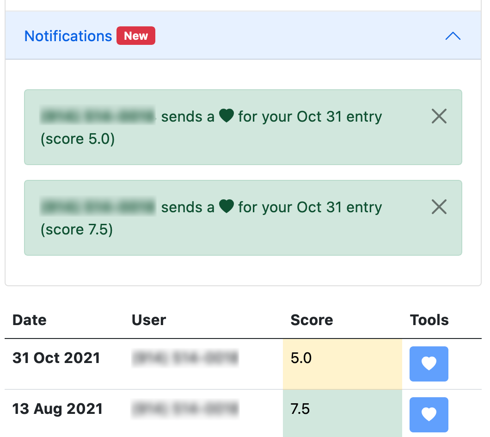

  <body class="py-4">
         <h1><a href="https://project-foxtrot.herokuapp.com/" class="link-primary">foxtrot</a>: a web-based mental health tracker</h1>
         <h2>The problem: it’s easy to lose track of ourselves. </h2>
         <ul> 
            <li>Stress, anxiety, or depression make it harder to be self-aware.</li>
            <li>But self-awareness is the key to mental health.</li>
        </ul>
        <h2>The solution: daily text reminders to check-in. </h2>
         <ul> 
            <li>Each text has a link to a unique URL where you can log how you feel that day and view past entries.</li>
            <li>Unsubscribe at any time.</li>
        </ul>
        
        <h2>Community: share with people you trust. </h2>
         <ul> 
            <li>Share your daily scores with trusted friends and family.</li>
            <li>Comments remain private.</li>
        </ul>
        
        <h2>Privacy</h2>
         <ul> 
            <li>The only identifying information we collect is your phone number.</li>
            <li>Your log is stored at a unique URL that is sent to you by text.</li>
        </ul>
        <h2>A work in progress</h2>
         <ul> 
            <li>Project Foxtrot is open source and hosted on <a href="https://github.com/eugenekkim8/project-foxtrot" class="link-primary">GitHub</a>.</li>
            <li>Suggestions and improvements are welcome.</li>
        </ul>
        
Convinced? Subscribe <a href="https://project-foxtrot.herokuapp.com/" class="link-primary">here</a>.

